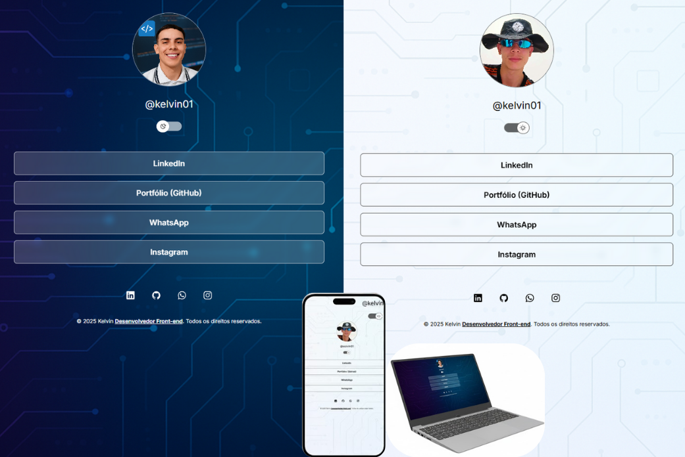

# Personal Profile 🔗

Projeto de perfil pessoal desenvolvido para centralizar links importantes como LinkedIn, Instagram e GitHub em uma única página, funcionando como um cartão de visitas digital.

🔗 **Projeto online:** https://kelvin-dev23.github.io/Personal-profile

---

## 🛠️ Tecnologias


---

## 📸 Preview


---

## 🎯 Objetivo do projeto
Criar um perfil online simples, responsivo e acessível para centralizar links pessoais e profissionais, facilitando o compartilhamento em redes sociais e processos seletivos.

---

## ✨ Funcionalidades
- Layout responsivo para desktop e mobile
- Alternância de tema claro e escuro
- Links centralizados para redes sociais
- Interface simples e intuitiva

---

## 🧩 Como o projeto funciona

### 🎨 Layout
O layout foi desenvolvido com foco em simplicidade e usabilidade, utilizando CSS puro para estilização e organização visual dos elementos.

### ⚙️ Lógica
A lógica em JavaScript é responsável principalmente pela interação do usuário, como a alternância de temas e manipulação básica do DOM.

### 📱 Responsividade
O projeto utiliza boas práticas de CSS para garantir uma boa experiência em diferentes tamanhos de tela, desde dispositivos móveis até desktops.

---

## ▶️ Como rodar o projeto localmente

1. Clone o repositório:
```bash
git clone https://github.com/kelvin-dev23/Personal-profile.git
